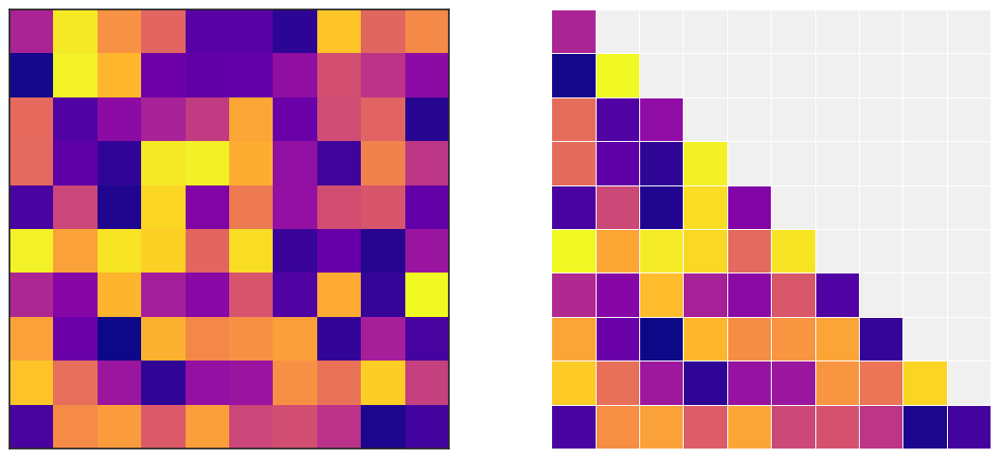
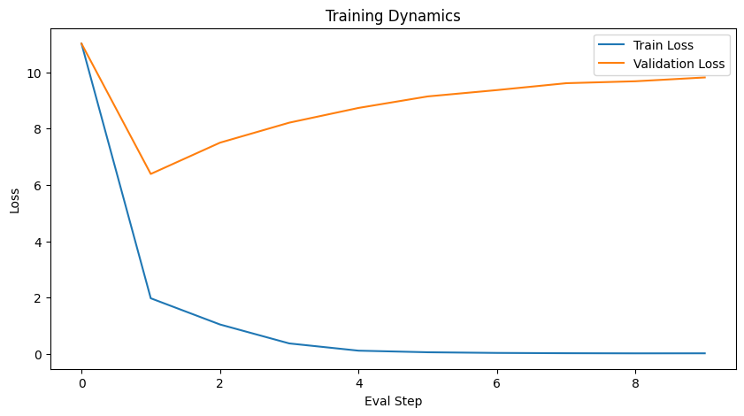
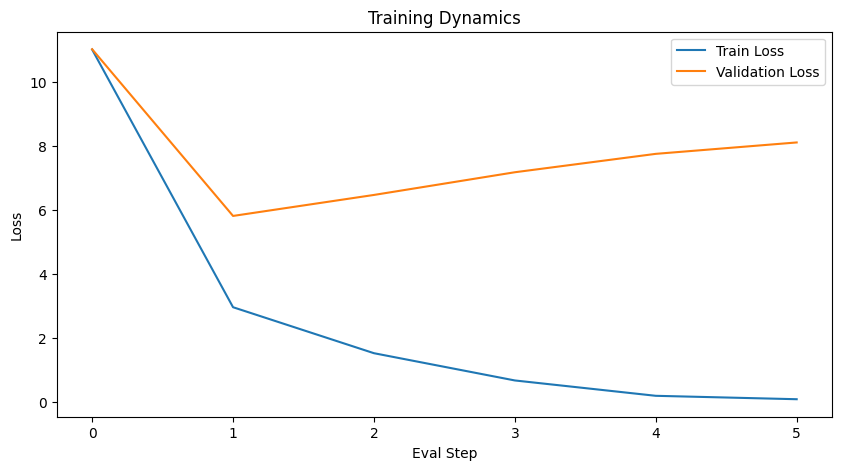
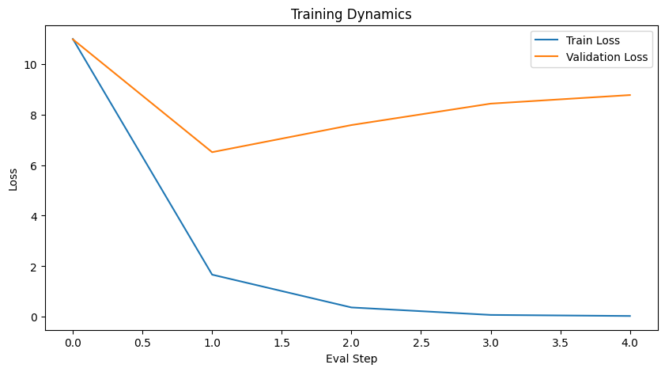
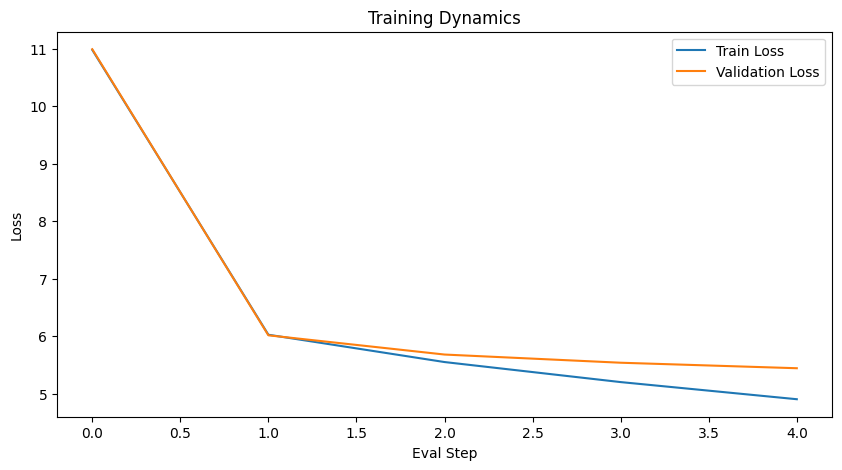

# Yet Again, an LLM from Scratch
## Building a Transformer-based Language Model using only PyTorch

**Carlo Bianchi**
*Università degli Studi di Firenze*

---

# The Goal

L'obiettivo del progetto è la comprensione profonda delle meccaniche dei Transformers eliminando le astrazioni fornite da librerie esterne.

- **No** Hugging Face / Transformers Library
- **No** Moduli PyTorch pre-costruiti (nn.Transformer)
- **No** Keras / Tensorflow high-level APIs

<br>

 Solo **PyTorch** per le operazioni tensoriali e la backpropagation, **TikToken** per la tokenizzazione.

---

# Outline

1. **Model Architecture**: Dal Transformer originale a GPT-2.
2. **Core Implementation**: Causal Self-Attention e gestione dei buffer.
3. **Experimental Setup**: Dataset e configurazioni allenate.
4. **Results & Analysis**: Studio sulla profondità e performance.
5. **Live Demo**: Generazione di testo in tempo reale.

---

# 1. Model Architecture

---

# Theoretical Foundation

Il modello implementato segue l'architettura **Decoder-only** introdotta da OpenAI, evoluzione del Transformer originale.

- **Vaswani et al. (2017)**: Meccanismo di *Self-Attention* e struttura a blocchi.
- **Radford et al. (2019)**: Specifiche GPT-2.
    - **Pre-normalization**: LayerNorm applicata prima dei blocchi residui per stabilità.
    - **GeLU Activation**: Gaussian Error Linear Units per una migliore non-linearità.
- **Why from scratch?** Controllo totale sul *causal masking* e sul flusso del gradiente.


---

# Architecture Overview


## Key Features:
- **Embedding Layer**: Token + Positional embeddings.
- **Transformer Block**: 
  - Multi-Head Attention.
  - LayerNorm (Pre-norm).
  - Feed-Forward Network.
- **Output Head**: Linear + Softmax su vocabolario TikToken.
---


---

# 2. Implementation Highlights

---
## Core Mechanism: Causal Attention

Il cuore del decoder è la capacità di generare testo auto-regressivamente senza "sbirciare" nel futuro.

$$
\text{Attention}(Q, K, V) = \text{softmax}\left( \frac{QK^T}{\sqrt{d_k}} + M \right) V
$$
--- 

## Causal Mask ($M$):
- Matrice triangolare superiore.
- Valori impostati a $-\infty$ per annullare l'attenzione sui token successivi.

---



---

## The Code: CausalSelfAttention

L'uso di `register_buffer` garantisce che la maschera faccia parte dello stato del modello senza essere trattata come parametro addestrabile.

```Python
class MultiHeadAttention(nn.Module):
    def __init__(self, context_length, ...):
        # Register the mask as a persistent buffer (non-trainable)
        self.register_buffer('mask', 
            torch.triu(torch.ones(context_length, context_length), diagonal=1))

    def forward(self, x):
        attn_scores = queries @ keys.transpose(2, 3) / math.sqrt(d_k)
        
        # Apply Causal Masking
        mask_bool = self.mask.bool()[:num_tokens, :num_tokens]
        attn_scores.masked_fill_(mask_bool, -torch.inf)
        
        attn_weights = torch.softmax(attn_scores, dim=-1)
        return attn_weights @ values
```
---

# 3. Experimental Setup

---

## Training Strategy

Per analizzare il modello sotto vincoli hardware (**Colab T4 GPU**), sono state testate 4 configurazioni principali.

* **Datasets**:
    * *The Verdict* (Edith Wharton) per test di convergenza rapidi.
    * *Moby Dick* (Melville) per stress test su scala maggiore.


* **Tokenizer**: TikToken (BPE, vocab_size: 50,257).
* **Metric**: Validation Cross-Entropy Loss.

---

## Configurations Comparison

| Config | Parametri (M) | Profondità (Layer) | Emb Dim | Val Loss |
| --- | --- | --- | --- | --- |
| **GPT_REAL** | 163M | 12 | 768 | **5.45** |
| **GPT_DEMO** | 120M | 6 | 768 | 8.76 |
| **GPT_DEEP** | 60M | 12 | 384 | 8.11 |
| **GPT_BALANCED** | 50M | 6 | 384 | 9.81 |


Il modello `GPT_DEEP` (più profondo ma stretto) mostra performance migliori del `GPT_DEMO` (più largo ma superficiale) nonostante la metà dei parametri.

---

| GPT_BALANCED | GPT_DEEP |
| :---: | :---: |
|  |  |
| GPT_DEMO | GPT_REAL |
|  |  |

---

## Depth vs. Width Study

Un quesito fondamentale: è meglio aumentare la dimensione degli embedding (Width) o il numero di layer (Depth)?

* **Risultato**: A parità di risorse, la profondità permette astrazioni semantiche più complesse. La pratica va d'accordo con la teoria.
* Il grafico `Depth Score` evidenzia come la perdita cali drasticamente con l'aumento dei layer, stabilizzandosi nel modello `REAL`.
---


---

# 5. Live Demo & Conclusions

---

## Live Demo

* **Setup**: Caricamento pesi pre-allenati (configurazione GPT2 Small).
* **Prompt**: *"The verdict was..."*
* **Decoding**: Greedy Decoding per massima determinismo e analisi dei token.

---


---

# Bibliography

* **Radford, A., et al. (2019)**. *Language Models are Unsupervised Multitask Learners*. OpenAI.
* **Vaswani, A., et al. (2017)**. *Attention Is All You Need*. NeurIPS.
* **Raschka, S. (2024)**. *Build a Large Language Model (From Scratch)*. Manning.
* **OpenAI (2022)**. *TikToken BPE Tokenizer*.
